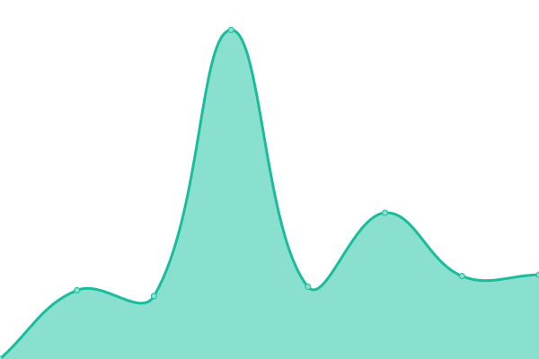

# [📈 Live Status](https://inl.github.io/ivdnt-statusoverzicht/): <!--live status--> **🟩 All systems operational**

This repository contains the open-source uptime monitor and status page for [Dutch Language Institute](https://www.ivdnt.org), powered by [Upptime](https://github.com/upptime/upptime).

With [Upptime](https://upptime.js.org), you can get your own unlimited and free uptime monitor and status page, powered entirely by a GitHub repository. We use [Issues](https://github.com/INL/ivdnt-statusoverzicht/issues) as incident reports, [Actions](https://github.com/INL/ivdnt-statusoverzicht/actions) as uptime monitors, and [Pages](https://inl.github.io/ivdnt-statusoverzicht/) for the status page.

<!--start: status pages-->
<!-- This summary is generated by Upptime (https://github.com/upptime/upptime) -->
<!-- Do not edit this manually, your changes will be overwritten -->
<!-- prettier-ignore -->
| URL | Status | History | Response Time | Uptime |
| --- | ------ | ------- | ------------- | ------ |
|  [ivdnt.org](https://ivdnt.org) | 🟩 Up | [ivdnt-org.yml](https://github.com/INL/ivdnt-statusoverzicht/commits/HEAD/history/ivdnt-org.yml) | 

 941ms
     
 | 

<a href="https://status.ivdnt.org/history/ivdnt-org">100.00%</a>
    

|  [anw.ivdnt.org](https://anw.ivdnt.org) | 🟩 Up | [anw-ivdnt-org.yml](https://github.com/INL/ivdnt-statusoverzicht/commits/HEAD/history/anw-ivdnt-org.yml) | 

 1103ms
     
 | 

<a href="https://status.ivdnt.org/history/anw-ivdnt-org">100.00%</a>
    

|  [brievenalsbuit.ivdnt.org](https://brievenalsbuit.ivdnt.org) | 🟩 Up | [brievenalsbuit-ivdnt-org.yml](https://github.com/INL/ivdnt-statusoverzicht/commits/HEAD/history/brievenalsbuit-ivdnt-org.yml) | 

 1068ms
     
 | 

<a href="https://status.ivdnt.org/history/brievenalsbuit-ivdnt-org">100.00%</a>
    

|  [brievenalsbuit2.ivdnt.org](https://brievenalsbuit2.ivdnt.org) | 🟩 Up | [brievenalsbuit2-ivdnt-org.yml](https://github.com/INL/ivdnt-statusoverzicht/commits/HEAD/history/brievenalsbuit2-ivdnt-org.yml) | 

 1081ms
     
 | 

<a href="https://status.ivdnt.org/history/brievenalsbuit2-ivdnt-org">100.00%</a>
    

|  [chn.ivdnt.org](https://chn.ivdnt.org) | 🟩 Up | [chn-ivdnt-org.yml](https://github.com/INL/ivdnt-statusoverzicht/commits/HEAD/history/chn-ivdnt-org.yml) | 

 911ms
     
 | 

<a href="https://status.ivdnt.org/history/chn-ivdnt-org">100.00%</a>
    

|  [corpusgysseling.ivdnt.org](https://corpusgysseling.ivdnt.org) | 🟩 Up | [corpusgysseling-ivdnt-org.yml](https://github.com/INL/ivdnt-statusoverzicht/commits/HEAD/history/corpusgysseling-ivdnt-org.yml) | 

 944ms
     
 | 

<a href="https://status.ivdnt.org/history/corpusgysseling-ivdnt-org">100.00%</a>
    

|  [corpusjuridischnederlands.ivdnt.org](https://corpusjuridischnederlands.ivdnt.org) | 🟩 Up | [corpusjuridischnederlands-ivdnt-org.yml](https://github.com/INL/ivdnt-statusoverzicht/commits/HEAD/history/corpusjuridischnederlands-ivdnt-org.yml) | 

 1158ms
     
 | 

<a href="https://status.ivdnt.org/history/corpusjuridischnederlands-ivdnt-org">100.00%</a>
    

|  [corpusmiddelnederlands.ivdnt.org](https://corpusmiddelnederlands.ivdnt.org) | 🟩 Up | [corpusmiddelnederlands-ivdnt-org.yml](https://github.com/INL/ivdnt-statusoverzicht/commits/HEAD/history/corpusmiddelnederlands-ivdnt-org.yml) | 

 1018ms
     
 | 

<a href="https://status.ivdnt.org/history/corpusmiddelnederlands-ivdnt-org">100.00%</a>
    

|  [corpusoudnederlands.ivdnt.org](https://corpusoudnederlands.ivdnt.org) | 🟩 Up | [corpusoudnederlands-ivdnt-org.yml](https://github.com/INL/ivdnt-statusoverzicht/commits/HEAD/history/corpusoudnederlands-ivdnt-org.yml) | 

 1127ms
     
 | 

<a href="https://status.ivdnt.org/history/corpusoudnederlands-ivdnt-org">100.00%</a>
    

|  [couranten.ivdnt.org](https://couranten.ivdnt.org) | 🟩 Up | [couranten-ivdnt-org.yml](https://github.com/INL/ivdnt-statusoverzicht/commits/HEAD/history/couranten-ivdnt-org.yml) | 

 1064ms
     
 | 

<a href="https://status.ivdnt.org/history/couranten-ivdnt-org">100.00%</a>
    

|  [diamant.ivdnt.org](https://diamant.ivdnt.org) | 🟩 Up | [diamant-ivdnt-org.yml](https://github.com/INL/ivdnt-statusoverzicht/commits/HEAD/history/diamant-ivdnt-org.yml) | 

 970ms
     
 | 

<a href="https://status.ivdnt.org/history/diamant-ivdnt-org">100.00%</a>
    

|  [domainlossandgain2023](https://domainlossandgain2023.eu) | 🟩 Up | [domainlossandgain2023.yml](https://github.com/INL/ivdnt-statusoverzicht/commits/HEAD/history/domainlossandgain2023.yml) | 

 4213ms
     
 | 

<a href="https://status.ivdnt.org/history/domainlossandgain2023">100.00%</a>
    

|  [dsdd.ivdnt.org](https://dsdd.ivdnt.org/DSDD) | 🟩 Up | [dsdd-ivdnt-org.yml](https://github.com/INL/ivdnt-statusoverzicht/commits/HEAD/history/dsdd-ivdnt-org.yml) | 

 893ms
     
 | 

<a href="https://status.ivdnt.org/history/dsdd-ivdnt-org">100.00%</a>
    

|  [e-ans.ivdnt.org](https://e-ans.ivdnt.org) | 🟩 Up | [e-ans-ivdnt-org.yml](https://github.com/INL/ivdnt-statusoverzicht/commits/HEAD/history/e-ans-ivdnt-org.yml) | 

 1025ms
     
 | 

<a href="https://status.ivdnt.org/history/e-ans-ivdnt-org">100.00%</a>
    

|  [evenementen.ivdnt.org](https://evenementen.ivdnt.org) | 🟩 Up | [evenementen-ivdnt-org.yml](https://github.com/INL/ivdnt-statusoverzicht/commits/HEAD/history/evenementen-ivdnt-org.yml) | 

 2788ms
     
 | 

<a href="https://status.ivdnt.org/history/evenementen-ivdnt-org">100.00%</a>
    

|  [etymologiebank.ivdnt.org](https://etymologiebank.ivdnt.org) | 🟩 Up | [etymologiebank-ivdnt-org.yml](https://github.com/INL/ivdnt-statusoverzicht/commits/HEAD/history/etymologiebank-ivdnt-org.yml) | 

 1025ms
     
 | 

<a href="https://status.ivdnt.org/history/etymologiebank-ivdnt-org">100.00%</a>
    

|  [ewnd.ivdnt.org](https://ewnd.ivdnt.org) | 🟩 Up | [ewnd-ivdnt-org.yml](https://github.com/INL/ivdnt-statusoverzicht/commits/HEAD/history/ewnd-ivdnt-org.yml) | 

 502ms
     
 | 

<a href="https://status.ivdnt.org/history/ewnd-ivdnt-org">100.00%</a>
    

|  [gtb.ivdnt.org](https://gtb.ivdnt.org) | 🟩 Up | [gtb-ivdnt-org.yml](https://github.com/INL/ivdnt-statusoverzicht/commits/HEAD/history/gtb-ivdnt-org.yml) | 

 773ms
     
 | 

<a href="https://status.ivdnt.org/history/gtb-ivdnt-org">100.00%</a>
    

|  [lexiconfrisicum.ivdnt.org](https://lexiconfrisicum.ivdnt.org) | 🟩 Up | [lexiconfrisicum-ivdnt-org.yml](https://github.com/INL/ivdnt-statusoverzicht/commits/HEAD/history/lexiconfrisicum-ivdnt-org.yml) | 

 528ms
     
 | 

<a href="https://status.ivdnt.org/history/lexiconfrisicum-ivdnt-org">100.00%</a>
    

|  [namescape.nl website](https://blog.namescape.nl) | 🟩 Up | [namescape-nl-website.yml](https://github.com/INL/ivdnt-statusoverzicht/commits/HEAD/history/namescape-nl-website.yml) | 

 859ms
     
 | 

<a href="https://status.ivdnt.org/history/namescape-nl-website">100.00%</a>
    

|  [namescape search](https://search.namescape.nl) | 🟩 Up | [namescape-search.yml](https://github.com/INL/ivdnt-statusoverzicht/commits/HEAD/history/namescape-search.yml) | 

 808ms
     
 | 

<a href="https://status.ivdnt.org/history/namescape-search">100.00%</a>
    

|  [namescape tagger](https://ner.namescape.nl/namescape/ui) | 🟩 Up | [namescape-tagger.yml](https://github.com/INL/ivdnt-statusoverzicht/commits/HEAD/history/namescape-tagger.yml) | 

 504ms
     
 | 

<a href="https://status.ivdnt.org/history/namescape-tagger">100.00%</a>
    

|  [namescape visualizer](https://visualizer.namescape.nl) | 🟩 Up | [namescape-visualizer.yml](https://github.com/INL/ivdnt-statusoverzicht/commits/HEAD/history/namescape-visualizer.yml) | 

 746ms
     
 | 

<a href="https://status.ivdnt.org/history/namescape-visualizer">100.00%</a>
    

|  [nederlandsedialecten.org](https://nederlandsedialecten.org) | 🟩 Up | [nederlandsedialecten-org.yml](https://github.com/INL/ivdnt-statusoverzicht/commits/HEAD/history/nederlandsedialecten-org.yml) | 

 3093ms
     
 | 

<a href="https://status.ivdnt.org/history/nederlandsedialecten-org">100.00%</a>
    

|  [neologismen.ivdnt.org](https://neologismen.ivdnt.org) | 🟩 Up | [neologismen-ivdnt-org.yml](https://github.com/INL/ivdnt-statusoverzicht/commits/HEAD/history/neologismen-ivdnt-org.yml) | 

 832ms
     
 | 

<a href="https://status.ivdnt.org/history/neologismen-ivdnt-org">100.00%</a>
    

|  [openconvert.ivdnt.org](https://openconvert.ivdnt.org) | 🟩 Up | [openconvert-ivdnt-org.yml](https://github.com/INL/ivdnt-statusoverzicht/commits/HEAD/history/openconvert-ivdnt-org.yml) | 

 598ms
     
 | 

<a href="https://status.ivdnt.org/history/openconvert-ivdnt-org">100.00%</a>
    

|  [opensonar.ivdnt.org](https://portal.clarin.inl.nl/opensonar_frontend/opensonar) | 🟩 Up | [opensonar-ivdnt-org.yml](https://github.com/INL/ivdnt-statusoverzicht/commits/HEAD/history/opensonar-ivdnt-org.yml) | 

 959ms
     
 | 

<a href="https://status.ivdnt.org/history/opensonar-ivdnt-org">100.00%</a>
    

|  [picto.ivdnt.org](https://picto.ivdnt.org) | 🟩 Up | [picto-ivdnt-org.yml](https://github.com/INL/ivdnt-statusoverzicht/commits/HEAD/history/picto-ivdnt-org.yml) | 

 614ms
     
 | 

<a href="https://status.ivdnt.org/history/picto-ivdnt-org">100.00%</a>
    

|  [pinkhof.ivdnt.org](https://pinkhof.ivdnt.org) | 🟩 Up | [pinkhof-ivdnt-org.yml](https://github.com/INL/ivdnt-statusoverzicht/commits/HEAD/history/pinkhof-ivdnt-org.yml) | 

 590ms
     
 | 

<a href="https://status.ivdnt.org/history/pinkhof-ivdnt-org">100.00%</a>
    

|  [portal.clarin.ivdnt.org](https://portal.clarin.ivdnt.org) | 🟩 Up | [portal-clarin-ivdnt-org.yml](https://github.com/INL/ivdnt-statusoverzicht/commits/HEAD/history/portal-clarin-ivdnt-org.yml) | 

 1175ms
     
 | 

<a href="https://status.ivdnt.org/history/portal-clarin-ivdnt-org">100.00%</a>
    

|  [taaladvies.net](https://taaladvies.net) | 🟩 Up | [taaladvies-net.yml](https://github.com/INL/ivdnt-statusoverzicht/commits/HEAD/history/taaladvies-net.yml) | 

 1267ms
     
 | 

<a href="https://status.ivdnt.org/history/taaladvies-net">100.00%</a>
    

|  [taalmaterialen.ivdnt.org](https://taalmaterialen.ivdnt.org) | 🟩 Up | [taalmaterialen-ivdnt-org.yml](https://github.com/INL/ivdnt-statusoverzicht/commits/HEAD/history/taalmaterialen-ivdnt-org.yml) | 

 1760ms
     
 | 

<a href="https://status.ivdnt.org/history/taalmaterialen-ivdnt-org">100.00%</a>
    

|  [taalportaal.org](https://taalportaal.org) | 🟩 Up | [taalportaal-org.yml](https://github.com/INL/ivdnt-statusoverzicht/commits/HEAD/history/taalportaal-org.yml) | 

 3810ms
     
 | 

<a href="https://status.ivdnt.org/history/taalportaal-org">100.00%</a>
    

|  [uitleenwoordenbank.ivdnt.org](https://uitleenwoordenbank.ivdnt.org) | 🟩 Up | [uitleenwoordenbank-ivdnt-org.yml](https://github.com/INL/ivdnt-statusoverzicht/commits/HEAD/history/uitleenwoordenbank-ivdnt-org.yml) | 

 1069ms
     
 | 

<a href="https://status.ivdnt.org/history/uitleenwoordenbank-ivdnt-org">100.00%</a>
    

|  [vertaalwoordenschat.ivdnt.org](https://vertaalwoordenschat.ivdnt.org) | 🟩 Up | [vertaalwoordenschat-ivdnt-org.yml](https://github.com/INL/ivdnt-statusoverzicht/commits/HEAD/history/vertaalwoordenschat-ivdnt-org.yml) | 

 606ms
     
 | 

<a href="https://status.ivdnt.org/history/vertaalwoordenschat-ivdnt-org">100.00%</a>
    

|  [woordcombinaties.ivdnt.org](https://woordcombinaties.ivdnt.org) | 🟩 Up | [woordcombinaties-ivdnt-org.yml](https://github.com/INL/ivdnt-statusoverzicht/commits/HEAD/history/woordcombinaties-ivdnt-org.yml) | 

 502ms
     
 | 

<a href="https://status.ivdnt.org/history/woordcombinaties-ivdnt-org">100.00%</a>
    

<!--end: status pages-->

[**Visit our status website →**](https://inl.github.io/ivdnt-statusoverzicht/)

## 📄 License

- Powered by: [Upptime](https://github.com/upptime/upptime)
- Code: [MIT](./LICENSE) © [Dutch Language Institute](https://www.ivdnt.org)
- Data in the `./history` directory: [Open Database License](https://opendatacommons.org/licenses/odbl/1-0/)
